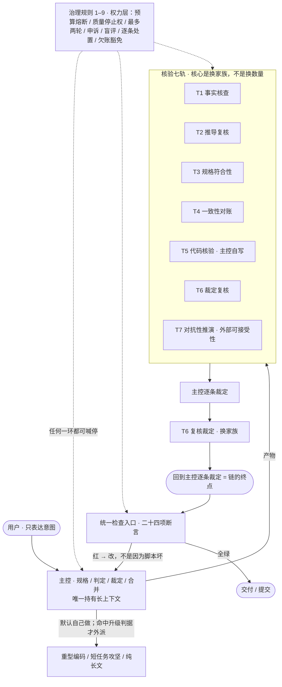

# 核验治理骨架 —— 让「发现」必须被处置、让「结果」可以被断言

> ## ⚙️ 运行要求（先看这个）
>
> **一台能跑 Node 22 的普通 Windows 电脑就够** —— **不吃 GPU、不吃多核、不吃大内存**。
> 真正的门槛是**磁盘约 2.6 GB** 与**能连上 npm**，**不是硬件性能**。
>
> | | 要求 |
> |---|---|
> | **操作系统** | **Windows 10/11**（部署脚本是 PowerShell；**Linux/macOS 无脚本**）|
> | **Node.js** | **≥ 22.19**（或 ≥ 24）—— 断言层单独只要 22.5 |
> | **pnpm** | 已装，或让 `corepack` 启用（脚本会自动试）|
> | **磁盘** | **约 2.6 GB**（随版本与插件变；`REQUIREMENTS.md` 里给了量的脚本）|
> | **内存** | 起步约 **200 MB**，日常 **400–900 MB** |
> | **网络** | 装的时候要能连 npm；**装完可断网** |
> | **API key** | **可留空**（起来后在设置页填）|
>
> **完整版（含每个数字的测法）见 [`REQUIREMENTS.md`](REQUIREMENTS.md)。**

> **先说清楚这是什么（以及不是什么）**
>
> **这是**：一套**断言层 + 治理规则**——**二十四项**机械检查（引用、计数、逐条处置、跨轮欠账、文档漂移、占位符、文件卫生、配置存活……），
> 外加一套**权力规则**（谁能喊停、欠账必须豁免或做掉、发现必须逐条处置）。**它们是零依赖的脚本，拿来就能跑。**
>
> **这不是**：「多模型核验框架」。**本仓库里没有派子会话去核验的代码** —— 核验那部分依赖一套你手上没有的运行时
> （见文末「它依赖什么」）。**本仓库提供的是"核验完之后怎么保证那些发现不会被漏掉"这一层。**
>
> **为什么值得看**：真正让核验失效的通常不是"没查出问题"，而是**"查出来了没人处置"**。
> 这里每一件都已经踩过坑：发现被批量合并成一行 ⇒ 跨两轮无人处置 ⇒ 其中三条是真窟窿。

**这个仓库里有一个可以立刻跑起来的最小示例。** 不需要任何 API key、不需要联网、不需要填配置。

---

## 两条路：只要这一层，还是要整套体系

这个仓库里有**两样东西**，它们**不是一回事**，请按需要挑：

| | **① 核验治理骨架**（本页主体）| **② 整套 DSH AI 体系**（`deploy/`）|
|---|---|---|
| **是什么** | 断言层 + 治理规则：二十四项机械检查、以及"谁能喊停"的权力规则 | 一个能跑起来的 AI 宿主：跨会话记忆、多智能体、用量账本、Web UI |
| **依赖** | **零依赖**。对**任何**项目都能用 —— 它检查的是你的产物 | 需要 **Windows + PowerShell 5.1+ + Node ≥ 22.19 + pnpm**；会装 7 个插件（约 2.6 GB 磁盘）|
| **怎么开始** | 往下读，下一节「一条命令」就是全部 | 见下 |

### 不想自己敲命令？交给 AI 装

把仓库地址（或 [`AI-INSTALL.md`](AI-INSTALL.md) 的路径）给你的 AI（DeepSeek / Claude / 任何能跑命令的），
**并附上这句话**：

```
请阅读这个仓库里的 AI-INSTALL.md，按它在本机安装「DSH AI 体系」。
每一步都真的执行并把原始输出给我看；标了「必须问使用者」的地方先问我；
任何一步失败就停下，把报错原文给我，不要跳过继续。
```

**`AI-INSTALL.md` 里写了**：环境自检命令 · 退出码语义（0/1/2 各代表什么）·
**14 种占位符里哪些 AI 能自己填、哪些必须问你** · **7 条红线**（不许跳验证、不许擅自 `-Force`、不许把猜测写成事实……）·
故障对照表。**它是给 AI 读的执行清单，不是给人读的概述** —— 下面这条命令是它最后会执行的东西。

---

### 要整套体系：**先干跑，再真装**

**★ 第一步永远是干跑**（它不碰任何东西 —— 实测：`~/.dsh` 文件数不变、关键文件 SHA256 不变、不生成备份、不建目录）：

```powershell
powershell -ExecutionPolicy Bypass -File deploy/install.ps1 -DryRun -WorkDir <你想用的工作区路径>
```

> **它只打印十步会做什么**，其中包括一段 **「本次会动的东西」** —— 逐条列出**它会改写哪个 profile、
> 跑几条 `plugin add`、以及那个 profile 里**哪些东西和本次清单不一致**（含"这是使用者自己的插件"）。
> **★ 那段请逐条读完再往下走。**
>
> **★ 2026-09-26 调整（访客报告 F8）**：这一段以前排在真装命令**之后**，而**真装那个代码块在最前面** ——
> 照代码块复制的人会**直接真装**（`AI-INSTALL.md` 的红线 4 明写「**不许在 `-DryRun` 没看过的情况下直接真装**」）。
> **现在把干跑提到第一个。** 两条命令只差一个旗标，别搞混：

```powershell
# ★ 看过干跑输出、确认无误之后，再去掉 -DryRun 真装：
powershell -ExecutionPolicy Bypass -File deploy/install.ps1 -WorkDir <同一个工作区路径>
```

**跑它之前，你需要有这些东西**（都是实测出来的数，不是估的）：

| 项目 | 要求 | 怎么来的 |
|---|---|---|
| **操作系统** | **Windows**（脚本是 PowerShell 写的）| **Linux / macOS 目前没有对应脚本** —— 你可以照这十步手工做，但没人为你验证过 |
| **PowerShell** | **5.1 或更高**（Win10/11 自带）| 实测 5.1.26100 |
| **Node.js** | **≥ 22.19**（或 ≥ 24）| 锁定的插件 `@linxin666/dsh-pet@0.3.25` 声明 `engines.node = ^22.19.0 || >=24.0.0` |
| **npm** | 在 PATH 里 | 装 Node 时勾选「加入 PATH」即可 |
| **pnpm** | 已装，或让 `corepack` 启用 | 脚本会尝试 `corepack enable pnpm` |
| **网络** | 能到 npm registry | 装插件要下载（实测网络抖动会导致个别插件失败，**脚本会明确报出来**）|
| **磁盘** | **约 2.6 GB**（随版本与插件变；`REQUIREMENTS.md` 里给了量的脚本）| 全局安装 0.37 GB + `DSH_HOME` 1.34 GB + pnpm 共享缓存 0.92 GB |
| **内存** | **起步约 200 MB，日常用 400–900 MB** | 实测：刚起 202 MB；作者跑久了的实例 434 MB |
| **CPU** | 无特殊要求 | 作者机器 18 逻辑核纯属过剩；起服务、聊天都不吃 CPU |
| **API key** | **可留空** | 起来之后在设置页填；DSH 原生支持 `deepseek-official` |

> **一句话**：**一台能跑 Node 22 的普通 Windows 电脑就够** —— 它不吃 GPU、不吃多核、不吃大内存。
> 真正的门槛是**磁盘（约 2.6 GB）**与**能连上 npm**，不是硬件性能。

它按顺序做**十件事**：环境检查 → 装 DSH 本体（**版本锁定**）→ 建工作区 → 初始化 profile →
**预置 pnpm 的两段关键配置** → 装 7 个插件（**版本锁定**）→ 核对它们真的进了组合树 →
落一份工作区指令模板 → 说明模型路由怎么填 + 自检 → **自己起一次服务验证**。

> **为什么第 5 步和第 10 步是重点**（都是实测踩出来的，不是设计出来的）：
> - **第 5 步**：pnpm 11 的 `allowBuilds` 与 `overrides` **不填值就不让装/装了也不加载** —— 而它在
>   `pnpm-workspace.yaml` 里写的是**占位符**（`cloudflared: set this to true or false`）。
> - **第 10 步**：装完那一刻，**所有读数都是绿的**（插件全在、组合树可读）；但**一起服务**才发现
>   11 个子插件 `failed to import`。**只看"装上了"会交付一个能启动、UI 残缺的半成品。**
>   ⇒ 所以脚本自己起一下服务、探活、看有没有 `failed to import`，然后停掉并释放端口（全程 `--no-open`，不会弹浏览器）。

**模型路由是留空的** —— 作者的走私有中转站，你没有。默认用 DSH 原生的 `deepseek-official`（也可以起来后在设置页填）。

> **两个脚本的分工**：`deploy/install.ps1` 管**装**；本页的 `checks/` 管**跑起来之后的产物治理**。
> 后者**不依赖**前者 —— 你可以只用 `checks/`，把它挂到任何已有的项目上。

---

## ★ 你以后升级 DSH 之前，先看这一节

**这套体系锁定了 `0.1.7-rc.2`** —— 而这不是"保守"，是**实测出来的结论**：

> **DSH 的插件与宿主是「模块级 API 契约」的强耦合。** 实测：`0.1.7` 的 `@deepseek-ai/dsh-settings`
> **删掉了两个导出**，而旧版插件的入口 `import` 它们 ⇒ **模块层直接失败** ⇒ 11 个插件报
> `failed to import`。**而宿主只给这一句，真实错误被吞掉了**（它在 `dsh-app-boot` 里写死成一个字符串）。

### 升级之后会发生什么（**而它不报错**）

**最危险的地方是它「看起来正常」**：

| 你会看到 | 实际情况 |
|---|---|
| 界面能打开、能对话 | ✅ 真的正常 |
| **插件没加载** | ❌ 跨会话记忆、多智能体、用量账本、Web UI **全都没了** |
| **没有任何报错** | 启动输出里**只有一句** `N entries did not activate` |

**⇒ 所以"升级之后还能用"不等于"升级之后是好的"。** 静默失效的代价不是"用不了"，是**"你以为它在跑"**。

### 升级后怎么自查

```bash
# 只看组合树：不起服务、不占端口、不弹窗
dsh --profile web --dump-config
```

**或者直接看启动输出里有没有这一行**：

```text
dsh: warning: N entries did not activate
```

**⇒ 有的话，N 就是没激活的插件数**（注意：退出码**仍是 0**、服务**照样起** —— 这正是它隐蔽的原因）。

### 你想升级，怎么办（按推荐顺序）

1. **等本仓库适配** —— 适配新版本后，`install.ps1` 里那个版本号会跟着更新；
2. **自己升，但之后要重跑一遍 `deploy/install.ps1`** —— 它会**拒绝**在别的版本上装（除非 `-Force`）；
   而 `-Force` 之后它会拿**本仓库锁定的那套插件版本**去装 —— **那可能不是你要的**，看清它打印的"本次会动什么"；
3. **升级前先备份 `~/.dsh`**（至少把 `profiles\` 与 `settings.yaml` 复制一份）——
   本项目吃过一次亏：升级时配置迁移**静默丢弃**了一个 section，**而日常对话完全正常**，
   只有"换一个模型家族去做核验"时才暴露 ⇒ **8 条模型通道全部失效而我不知道**。

### 万一你已经升上去了（**而那时才发现**）

**先确认是不是这个问题** —— 三条证据，**缺一条就不是它**：

1. 启动输出里有 `N entries did not activate`（**N ≥ 1**）；
2. 那几行里能看到 `failed to import`；
3. 界面**还能开、能对话**，而**跨会话记忆 / 多智能体 / 用量账本 / Web UI 不见了**。

**确认之后，两条路**：

**① 最快的：把 DSH 装回本体系适配的那个版本**

```bash
npm install -g @deepseek-ai/dsh@0.1.7-rc.2
# 装完重启 DSH
```

> ⚠️ **一个已知的副作用（本项目实测）**：从更早的版本升到 `0.1.7` 时，DSH 会把
> `~/.dsh/settings.yaml` **改名成 `settings.yaml.imported`**（**内容一字不变**，但**旧版读的是 `settings.yaml`**）。
> **⇒ 所以回退之前先看一眼那个文件在不在** —— 不在的话，把 `.imported` 复制一份成 `settings.yaml`
> （**是复制，不是改名**：新版还在用那份 `.imported`）。
> **⇒ 最稳的做法永远是**升级前就备份 `~/.dsh`**。

**② 或者等本仓库适配** —— 适配新版本之后，`deploy/install.ps1` 里那个版本号会跟着更新。

**★ 而如果你什么都没备份，也别慌**：
把启动输出里那几行 `did not activate` **贴到本仓库的 issue** ——
**那几行里就写着是哪个插件、哪个版本对不上**，有它就能定位。

### ★ 那"现在要不要升级"？

**现在没有比 `0.1.7-rc.2` 更新的版本可升** —— 实测（`npm view @deepseek-ai/dsh dist-tags`）：

```
latest = 0.1.5-rc.3     ← 比本体系适配的还旧（那条线生态更旧，不要碰）
next   = 0.1.7-rc.2     ← ★ 就是本体系适配的这个
alpha  = 0.1.7-alpha.2
```

**⇒ 所以"暂时不用担心"不是安慰，是有依据的**：
**npm 上最新的那条线，正是这套体系锁定的那一条。**
> **★ 一句话**：**这套东西的"能用"，是"版本对上了"才成立的** ——
> 而版本对不上时，它坏得很安静。
---

## 一条命令

> 需要 **Node.js ≥ 22.5**（其中「记忆毕业」那一项用了 `node:sqlite`，它是实验特性，需 22.5+）。
>
> ★ **别和上面那个 22.19 搞混 —— 它们是两个不同的门槛**：
> · **断言层（这一节）**：≥ **22.5**，因为用到 `node:sqlite`；
> · **整套体系（`deploy/`）**：≥ **22.19**，因为锁定的插件要求 `^22.19.0 || >=24.0.0`。
> ⇒ 想两个都跑，**装 Node ≥ 22.19 即可**（它同时满足 22.5）。
> 零依赖、零配置、**不需要 API key、不需要联网**。

```bash
node checks/_check_all.cjs --fast --target example/_target.json
> **★ 这个块是给人看的摘要，不是逐字复制品。** 下面这些地方**被省略了**，你自己跑的时候会多出来：
> · 跳过项后面会**多一段原因**（如 `⏭️ 未配置：guide ⇒ 本项**跳过**（自定义目标模式下不回落默认布局）`）；
> · 开头会多两行表头（`目标工程：…` 与 `=== 统一检查入口 ===（--fast：跳过联网检查）`）。
> **⇒ 判读时以「汇总行」为准**（它逐字一致）；逐项对照看 **✅ / ⏭️ 的分布**，不要逐字比。
```

预期输出（**这就是本仓库的验收判据**）：

```text
⏭️  预算闸门（`_target.json` 声明无账本 ⇒ 跳过）
▶ JSON 预检 … ✅ 通过
▶ 语法门 … ✅ 通过
▶ PS 语法门 … ✅ 通过
▶ 引用检查 … ✅ 通过
▶ 发布闸门 … ✅ 通过
▶ 目录符合性 … ✅ 通过
▶ 占位符检查 … ✅ 通过
▶ 文件卫生 … ⏭️  跳过（未配置）
▶ 文本卫生 … ✅ 通过
⏭️  收敛账计数（参数未配置）
▶ 发现处置链路 … ✅ 通过
▶ 跨轮结转欠账 … ✅ 通过
▶ 文档漂移 … ⏭️  跳过（未配置）
▶ 记忆毕业 … ⏭️  跳过（未配置）
▶ 配置存活 … ⏭️  跳过（未配置）
▶ 验证代表性 … ⏭️  跳过（未配置）
▶ 覆盖矩阵 … ✅ 通过

▶ 重复清单 … ✅ 通过
⏭️  快照复查（--fast 跳过）
通过 12 / 12（另有 8 项跳过）
```

> **★ 为什么你在自己机器上跑出来的通过数可能比上面多 3？**
> 上面那个 `通过 12 / 12` 是**在"没有 .git 的干净副本"里**跑的（发布前会这么验一次）——
> 而其中「**历史卫生**」与「**发布同步**」与「**提交信息**」这三项**需要 git 仓库**才能跑，所以在那种副本里它们显示 `⏭️ 跳过`。
> **你 clone 下来的仓库是带 `.git` 的**，于是那三项会真的跑起来，读数就变成 `通过 15 / 15`。
> **两个数都对 —— 它们回答的是"在哪跑"，不是"哪个更好"。**
>
> **★ 如果你用的是 Linux / macOS，这个数字会不一样：会变成 `通过 12 / 12（另有 9 项跳过）`。**
> 原因是 **`PS 语法门`**（用 PowerShell 解析器查 `.ps1` 语法）**在没有 PowerShell 的平台上会显式跳过** ——
> **那是设计如此，不是出错。**（2026-09-26 实测：把 `process.platform` 伪装成 `linux` 跑一遍，
> 那项报 `⏭️ 非 Windows 平台 ⇒ 本项跳过（没有 PowerShell 可调）`，其余 8 项照跑、`exit 0`。）
>
> **除此之外，断言层对三个平台一视同仁** —— 零依赖 Node，没有硬编码路径或平台专有命令。


> **⚠️ 那 8 个「跳过」不是同一回事 —— 输出里可以分清，但一眼扫过去容易混。** 三种情况：
>
> | 情况 | 例子 | 含义 |
> |---|---|---|
> | **没配对象** | 语法门 / 文件卫生 / 收敛账计数 / 记忆毕业 / 文档漂移 | 示例工程里**没有**这类文件；你自己的项目配了它就会跑 |
> | **点了名但本子集没实现** | 配置存活 / 验证代表性 / 快照复查 | **本子集有意未包含实现**（它们依赖作者本机的运行时）。占位实现会打印原因后跳过 —— **不是"没问题"** |
> | **主动关闭** | 预算闸门（`budgetLedger: null`） | 你要它跑，把配置补上就行 |
>
> **「没查」和「查过了」在输出里长得不一样，这是这套东西的底线。** 但**「没配」和「没实现」也得自己分清** —— 前者是你的责任，后者是这一版的边界。

> **`--fast` 是可选的，不是必须的。** 它的作用是**跳过「快照复查」**（那是一项"会过期的事实"的定期重校）。
> 在本子集里那一项是**占位实现、本来就跳过**，所以**带不带它结果完全一样**（都 10 / 10、都 exit 0）——
> 实测确认过，不是推测。
> **在你自己的环境里**：如果你配好了那一项、又不想每次收尾都跑它，**那时**才需要 `--fast`。

**`--target` 也可以省** —— 不给参数时自动使用 `example/_target.json`，所以下面这条**结果相同（10 / 10）**：

```bash
node checks/_check_all.cjs --fast
```

---

---

## ★ 收尾一条命令（**替你管住顺序**）

上面那条是**断言层的一条命令**。而**日常收尾**要跑的是好几步，**并且它们有固定的顺序** ——
（改了源 ⇒ 要先重新生成，**再复跑**文本卫生）—— **⇒ 所以另有一条"替你管住顺序"的入口**：

```bash
node checks/_finish.cjs                  # 文本卫生 → 生成 → 复跑 → 统一入口 → 发布同步
node checks/_finish.cjs --with-visitor   # 再加"访客视角"（从远端 clone 一份跑一遍，联网 ~40 秒）
node checks/_finish.cjs --allow-red      # 允许它有红（例如你正改到一半）
```

**它的行为是"失败就停"，并把三种"不绿"分开报**：

| 报什么 | 意思 | 要不要管 |
|---|---|---|
| **失败** | **真的有问题** | **要** —— 去读那一步的输出 |
| **预期内的红** | 第一遍文本卫生报「生成物陈旧」 | **不用** —— 那是设计上会出现的（改了源还没生成），**它自己会接着生成** |
| **提醒** | 发布同步红了 | **不用** —— 那只是"还没推到远端" |

> **★ 为什么给这条命令**：那几步**顺序敏感**，而**本书作者自己就漏过至少三次**
> （每次都是看输出才发现"顺序反了"）。**⇒ 把"我记得按顺序跑这几条"变成一个入口。**

## 二十四项断言分别管什么

> 示例工程只配置了其中 12 项能跑的对象；**另外 8 项在示例里显示 ⏭️ 并写明原因** ——
> **「没查」和「查过了」在输出里长得不一样，这是这套东西的底线。**

| 项 | 一句话 |
|---|---|
| **JSON 预检** | 所有 `.json` 都能解析。**报错时直接打出出错位置附近的原文** —— 中文引号写错是最常见成因 |
| 语法门 | 所有 `.cjs` 都能通过 `node --check`（改完脚本手滑留下半个括号，这一项会先拦住） |
| 预算闸门 | 对外付费派发前的熔断闸门（示例声明无账本 ⇒ 跳过） |
| 引用检查 | 文档里的「文件名 + 行号」引用不悬空、短名不歧义 |
| 发布闸门 | 待发布内容里没有密钥、个人身份、客户标识等敏感模式。**⚠️ 公开版的规则表是一个"模板"** —— 原本针对特定项目的条目已整块移除，**你得先把它换成你自己项目的模式**，否则它会照样打印「0 BLOCK / 0 WARN」却什么都没查（脚本自己警告过这一点） |
| 目录符合性 | 「目标声明」里列的每一条要求，在「成品」里都有落点 |
| **占位符检查** | 成品里没有 `⬜ / 待填 / 待核 / 待补 / 未实测 / TODO` 这类**未完成态标记**。**判「不能提交」可靠，判「可以提交」不可靠**（只认字形、不认语义） |
| 文件卫生 | 工作树里没有临时文件、编辑器备份、零字节文件这类垃圾 |
| 收敛账计数 | 逐条裁定的计数与外部清单一字不差 |
| **发现处置链路** | 核验方报出的**每一条**发现，都单独有一行处置。**批量合并、范围缩写都不算** |
| **跨轮结转欠账** | 上一轮记为「未做」的事，这一轮必须**做掉或书面豁免**；豁免必须带触发条件 |
| **文档漂移** | 规则文件与操作文档**没有脱节**：脚本都进了流程、声明的步数=实际步数、引用的规则真的存在 |
| 记忆毕业 | 每条「教训」都要有归宿：能机械化的**当天变成断言**，不能的写明「只能靠外部复核」 |
| **配置存活** | **「配置写在那里」不等于「运行时读到了」** —— 升级 / 迁移后一个 section 被静默丢弃，会让一整层功能失效**而毫无报错**（作者就是这么丢掉 8 条模型通道的，还因为"日常那条恰好幸存"而毫无察觉）。本子集未含实现，占位跳过 |
| **验证代表性** | **用「精简组合」做的验证，不能推断「完整组合」可用** —— 先列一遍"它比生产少了什么"；少的东西里有你要验证的对象，那个"通过"就不能外推。本子集未含实现，占位跳过 |
| **快照复查** | 会过期的事实（价格、倍率、版本）按期重校（`--fast` 下跳过） |

> **这些断言自己怎么证明自己有效？** —— 仓库带了 `checks/_selftest.cjs`：
> 它把 `example/` 拷到临时目录、**注入一个已知缺陷**，然后**要求对应的断言必须变红**。
> **如果一个断言在注入缺陷之后仍然报绿，那它就不是断言，是装饰。**
>
> ```bash
> node checks/_selftest.cjs
> ```
> （按需运行 —— 它要往临时目录写缺陷样本，所以不在上面那条命令里。实测 **27 / 27** 全部"咬到了"（其中 8 条是"误报类"：注入合法用法 ⇒ 必须不报红）。）
>
> ⚠️ 它自己也会犯错：第一版用例里我挑了一个**「或」关系**的检查项去抹，抹掉一个词它当然还绿 ——
> 那会得出「断言是装饰」的**错误结论**。所以每个用例都必须**回读确认扰动真的生效**，
> 否则算「用例失效」而不是「断言没咬到」。

---

## 它保证什么 / 不保证什么

**保证**（这些是**机械可判**的，红了就是真有问题）：

- 格式不漂、引用不断、发现被逐条处置、欠账不会被忘；
- 「跳过」与「通过」**在输出里长得不一样** —— 未配置的项明确显示 ⏭️ 并给出理由。

**不保证**（这些**必须靠人/外部模型**）：

- ❌ **断言只看"字符串在不在"，看不了"事情做没做对"。** 一段文字写了"落实了"，断言就认为落实了；
- ❌ **抓不到语义级的敏感信息** —— 发布闸门是正则，只能算第一道网；
- ❌ **判据本身对不对，没有人替你保证**。判断"这个指标定得合理吗"仍然需要真正的领域专家；
- ❌ **一份材料可以在这二十四项全绿的情况下依然没答对题** —— 这是最根本的已知盲区；
- ❌ **散文层写错了行为，它抓不到。** 这一条是**同一类错犯了三次之后才承认的**：
  它管的是"脚本在流程文档里出现没有""步数 = 实际步数"这类**结构一致性** ——
  而"文档说要 Node ≥ 22.5、代码实际要 22.19"**在结构上完全自洽**（两处都是合法文本，没有任何一条规则会红）。
  **三次的发现者依次是：访客 / 访客 / 用户 —— 没有一次是断言或作者自查抓到的。**
  ⇒ **想让这一层可靠，只能让别人读你的文档。** 作者能做的只有一条操作纪律：
  **改完任何"被文档描述过的行为"之后，当场全仓搜一遍那个数字或那句话。**

**另外三件同量级的事实，也说在这里（不藏在运行时输出的小字里）：**

1. **上面那个「10 / 10」只演练了二十四项里的十二项。** 另外八项显示 ⏭️ —— 但**它们是三种不同的原因**：**五项是"示例没给它们配对象"**（你的项目配了就会跑）、**三项是"本子集没含实现"**（依赖作者本机的运行时）、**还有一项是你主动关的**（预算闸门，配置里写成 `budgetLedger: null`）
2. **演示里的「发布闸门 ✅」不构成脱敏证明。** 公开版的规则表是**模板**（针对特定项目的条目已被移除以避免泄露），它打印的「0 BLOCK / 0 WARN」只说明"按这套模板没查到"，**不说明这份内容真的干净**。
3. **这套东西的作者在自己的仓库上被这套东西骗过。** 有一次三项断言（脱敏自检 / 发布闸门 / 文档漂移）**同时报绿**，而它们一个真实问题都没抓到 —— 根因分别是：自检清单和脱敏清单同源、闸门规则被裁剪过、扫描根算错（在扫仓库外面的目录）。**⇒ 「绿」和「干净」是两件事**；这条警示写在这里，因为它是这套体系最需要外部核验的地方。

---

## 一条自曝：本体系最想被反驳的命题

> **主控（长上下文那个模型）拿走了全部高杠杆角色 —— 规格、判定、裁定、合并 —— 而支持它胜任这些角色的证据几乎为零。**

我们知道几个核验者有**偏差**（某个家族在「某条要求是否落实」上会稳定假阳性；另一个按文件名检索会漏内容命中），
但**从不知道它们有多准** —— 因为**从没有一批带已知真值的材料去标定过它们**。

**这个仓库欢迎的攻击方向就是这一条。** 如果你有办法证明「主控不胜任规格/裁定」，那比修掉任何一个 bug 都值钱。

---

### `docs/` 里那 12 个文档，什么时候看哪个

> **2026-09-26 加**：此前 README 只提了其中 5 个，**另 5 个核验轨道模板一个字都没提** ——
> 访客在 `docs/` 里看到 12 个文件，**不知道该看哪个、也不知道什么时候该看**。
> **下面按"你现在处于哪一步"排** —— 和你无关的那些，**现在不用看**。

| 你现在 | 看哪份 |
|---|---|
| **刚开始，只想跑起来** | **不用看 `docs/`** —— 回到上面的「不想自己敲命令？交给 AI 装」或「一条命令」 |
| **要接进自己的项目** | **`配置说明.md`**（字段总表 + 最小可用配置 + 退出码）· **`产物格式.md`**（那几份目标文件长什么样）|
| **想改路由 / 看真实样例** | **`路由策略示例.md`** |
| **开始往外派活、想要规矩** | **`派发流程.md`**（八步）· **`治理规则.md`**（谁能喊停、发现必须逐条处置）|
| **已经在跑核验、要给核验者写任务书** | **`T3-规格符合性.md`** · **`T4-一致性对账.md`** · **`T5-代码核验.md`** · **`T6-裁定复核.md`** · **`T7-对抗性推演.md`**（五条轨道，各管一类问题）|
| **想知道"该信哪个核验者的哪类结论"** | **`核验者能力档案.md`** |

> **★ 一句话**：**这 11 份不是"必读清单"，是"按需查阅"** ——
> **开头那几条路走通了，你就已经用上它了；剩下的等你遇到对应的问题再翻。**
## 目录

```text
README.md          ← 你正在读的这份
LICENSE            ← MIT
docs/              ← 文档集（见下表）
checks/            ← 二十四项断言的脚本 + 路径解析（_paths.cjs 是配置层）
example/           ← 最小可复现示例：目标声明 / 成品 / 核验报告 / 裁定记录 / 处置清单 / 结转账
deploy/            ← 一键部署**整套 DSH AI 体系**（install.ps1，**十步**；见上面「两条路」）
```

**`docs/` 里有什么 —— 按"你什么时候需要它"排**：

| 文件 | 什么时候看它 |
|---|---|
| ★ **`配置说明.md`** | **动手配 `_target.json` 之前** —— 每个字段干什么、**5 个示例里从没露面的启用键**、"不配置"的三种写法、退出码 |
| ★ **`保障清单.md`** | **想知道"那个通过数有多少含金量"时** —— **机器生成**的，五节：① 统一入口里**每一项**断言各管什么、有没有反例测试；② 生成公开集时的**几道闸**、哪一道是**预防性**的；③ 反例自检（"能不能咬人"）；④ **同一类错在不同文件类型上的拦截厚度**；⑤ **你实际敲的那两个入口各自守着什么** |
| ★ **`产物格式.md`** | **动手写那七份产物之前** —— 数据流、**哪两处必须逐字对得上**、四个真会卡住的地方 |
| `治理规则.md` | 想知道"这些规则**为什么**存在" —— 每条都附了它产生时踩的坑 |
| `派发流程.md` | 想复刻"把产物送去独立核验、再逐条裁定"这套流程 |
| `核验者能力档案.md` | 想知道"哪种模型适合查哪一类问题" |
| `T3`–`T7` 任务书 | 每次派发核验时用的模板（**本子集只含 T3–T7**；T1/T2 的规程写在一个未发布的技能包里） |
| `路由策略示例.md` | 作者自己的模型路由样例 —— **是给人读的样例，不是给 agent 吃的策略** |

> **为什么这里没有 `AGENTS.md`**：那份文件原本会被 DSH 类工具**自动注入每一个会话的系统提示**。
> 把它放在仓库根，等于让**访客的 agent** 也吃下作者的私有策略（含派发、预算、路由）。
> ⇒ 它被改名成 `docs/路由策略示例.md`：**是给人读的样例，不是给 agent 吃的策略。**

**`checks/_paths.cjs` 是这套东西能脱离原作者环境运行的关键**：它把「逻辑名 → 真实路径」解耦，
并且**只在显式 `--target` 时切换目标**；**未配置的项不会回落到默认布局**（否则会悄悄混用两个工程、得出假绿）。

---

## 体系全貌（一图）



**读图要点**：T1–T6 查「是否符合要求」（内部正确性），**T7 查「能不能被否掉」（外部可接受性）** —— 一份材料可以 T1–T6 全绿而 T7 报出一票否决级问题。

---

## 怎么用到你自己的项目上

> **⚠️ 先看这张表，能省你半小时**：接入要准备的东西**比"四件"多**。
> 下面这张是**完整清单** —— 少配哪一份，对应的检查就**静默跳过**（不报错，但保障消失）。

| 你要准备的文件 | 喂给哪项检查 | 配置键 | 不配的后果 |
|---|---|---|---|
| **目标声明**（`example/目标声明.md`） | 目录符合性 | `declaration` | 该项跳过 |
| **成品**（`example/成品.md`） | 目录符合性 / 占位符 | `product` | 该项跳过 |
| **符合性映射**（`example/符合性映射.json`） | 目录符合性 | `conformanceMap` | 该项跳过 |
| **核验报告**（`example/核验报告.md`） | 发现处置链路 | 由 `dispositionScanDirs` 扫到 | 该项跳过 |
| **裁定记录**（`example/裁定记录.md`） | 发现处置链路 | 同上 | 该项跳过 |
| **处置清单**（`example/处置清单.json`） | 发现处置链路 | `dispositionManifest` | 该项跳过 |
| **结转账**（`example/结转账.json`） | 跨轮结转欠账 | `carryover` | 该项跳过 |

**步骤**：

1. **照 `example/` 的七份文件准备**（**不是四份** —— 最初这页写少了两份，2026-09-25 由一次模型访客测试发现并更正）；
2. 把「核验报告里的编号」与「裁定记录里的处置行」在 `处置清单.json` 里连起来；
3. 跑：
   ```bash
   node checks/_check_all.cjs --fast --target <你的配置>
   ```
   **`--fast` 可带可不带** —— 它是"跳过快照复查"的开关，而本子集里那一项是占位实现、本来就不跑。
4. 红了就改 —— **红了不是因为脚本坏，是因为有一件事真的没做。**

> **⚠️ 路径基准的坑：`example/` 能跑，不代表你原样复制过去也能跑。**
>
> `_target.json` 里**条目内的相对路径以该文件所在目录为基准**。示例里 `"repoRoot": ".."` 指的是"示例目录的上一级" ——
> **你若把配置原样搬到项目根目录，`..` 就指到项目外面去了**。搬之前，把 `repoRoot` / `verifyBase` / `scanDirs` /
> `dispositionScanDirs` / `publishTargets` 这几项按你自己的目录布局**重写一遍**。

> **⚠️ 但先说清楚它依赖什么（这是本仓库最容易被高估的地方）**
>
> **可迁移的**：`checks/` 里那批断言脚本 —— 零依赖、只吃文件和 JSON，跟用什么模型、什么平台无关。
>
> **不可迁移的**：**核验那七条轨道（T1–T7）**。它们的任务书是为「**主控派一个子会话去独立核验，再逐条裁定**」这个流程写的，
> 而这个流程依赖作者自己的运行时（子会话派发、每会话注入的策略文件、跨会话记忆）。
> **`docs/派发流程.md` 里的代码片段不是通用 API** —— 它是**这一套运行时**的写法。
> **本子集里只发布了 T3–T7 五份任务书**（T1/T2 的规程写在一个未发布的技能包里，故缺席）。
>
> **⇒ 正确的预期**：拿走的是**断言层 + 治理规则的思想**（发现必须逐条处置、欠账必须豁免或做掉、判据先写后看产物）；
> **核验层要按你自己的工具重写**。把它当"我家厨房的操作规程"读，比当"可复用的框架"读更接近事实。

---

*本仓库的文档由脚本从内部真文档**脱敏生成**，不是手工维护的副本（手工副本必漂移）。*
