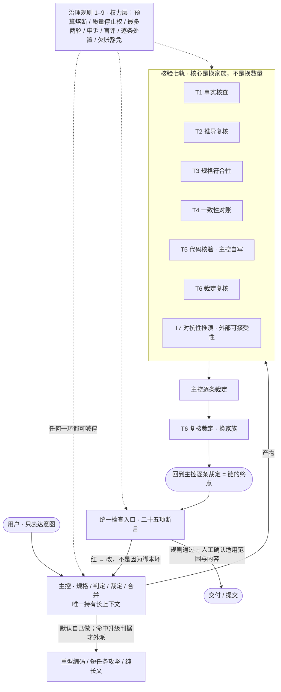

# dsh-ai-system：检查 AI 的工作有没有漏掉收尾

假设你让 AI 写一份项目方案。评审提出了三条问题，AI 修改后说“已经处理完”。你还得确认：三条问题是否**分别留下处理记录**？没解决的事有没有带到下一轮？文档里的引用和附带的脚本还能不能用？

这个仓库把一部分收尾检查做成了脚本。配置好检查对象后，它会核对交付文件、评审记录和待办清单，并报告哪些检查通过、失败或跳过。例如，评审记录有 A-01、A-02、A-03，处置清单只写了前两条，它会指出 A-03 没有单独记录。**它只检查记录是否符合规则，不能判断“已处理”是否属实**；内容和专业结论仍要由人或独立评审核对。

想先看看它怎么工作？安装 [Node.js 22.5 或更新版本](https://nodejs.org/)，在新克隆的仓库根目录运行：

```bash
node checks/_check_all.cjs --fast --target example/_target.json
```

这条命令检查仓库自带的示例，不需要 API key，也不需要安装 DSH。输出中的 ✅ 表示**该项规则在本次检查范围内通过**，⏭️ 表示没有检查；**跳过不等于通过，全部显示绿色也不等于交付内容正确**。如果在有未提交修改的工作区运行，还会看到“尚未同步到远端”的提醒。示例和各项状态的说明见下文[“一条命令”](#一条命令)。

仓库还提供一个**可选的 DSH 安装脚本**，用于搭建带聊天界面、记忆和用量记录的 AI 运行环境。它与上面的检查脚本是两部分：只想检查已有项目，可以只用 `checks/`；想安装整套环境，再看下面的安装步骤。安装脚本按 Windows 编写，详细要求见 [`REQUIREMENTS.md`](REQUIREMENTS.md)。本仓库提供部分独立核验的任务书，**没有自动调用多家模型完成审稿的调度代码**；检查脚本主要核对审稿后的记录与交付流程。

---

## 选一种用法

| 你想做什么 | 用仓库里的什么 | 需要准备什么 |
|---|---|---|
| 给已有项目增加交付检查 | `checks/` 中的脚本，以及自己的检查对象清单 | Node.js；先运行上面的自带示例，再按[配置说明](docs/配置说明.md)接入自己的项目 |
| 在 Windows 上搭建带聊天界面的 DSH 环境 | `deploy/install.ps1` 安装脚本 | Windows、PowerShell、Node.js、pnpm 和约 2.6 GB 磁盘空间；先看 [运行要求](REQUIREMENTS.md) |

### 安装完整的 DSH 环境：可以让 AI 按清单协助

把仓库地址（或 [`AI-INSTALL.md`](AI-INSTALL.md) 的路径）给你的 AI（DeepSeek / Claude / 任何能跑命令的），
**并附上这句话**：

```
请阅读这个仓库里的 AI-INSTALL.md，按它在本机安装「DSH AI 体系」。
每一步都真的执行并把原始输出给我看；标了「必须问使用者」的地方先问我；
任何一步失败就停下，把报错原文给我，不要跳过继续。
```

**[`AI-INSTALL.md`](AI-INSTALL.md) 里写了**：环境自检命令 · 退出码语义（0/1/2 各代表什么）·
**14 种占位符里哪些 AI 能自己填、哪些必须问你** · **7 条红线**（不许跳验证、不许擅自 `-Force`、不许把猜测写成事实……）·
故障对照表。**它是给 AI 读的执行清单，不是给人读的概述** —— 下面这条命令是它最后会执行的东西。

---

### 要整套体系：**先干跑，再真装**

**先干跑，再决定是否安装**。作者在测试环境中确认，干跑没有改写 `~/.dsh` 的文件或生成备份；在你自己的机器上，仍应阅读它列出的变更对象：

```powershell
powershell -ExecutionPolicy Bypass -File deploy/install.ps1 -DryRun -WorkDir <你想用的工作区路径>
```

> **它预览安装步骤**，其中包括一段 **「本次会动的东西」**：列出目标 profile、计划执行的插件安装，以及与本次清单不一致的现有插件。
> **★ 那段请逐条读完再往下走。**
>
> 看过干跑输出并确认变更范围后，才运行下面的安装命令。两条命令只差 `-DryRun`：

```powershell
# ★ 看过干跑输出、确认无误之后，再去掉 -DryRun 真装：
powershell -ExecutionPolicy Bypass -File deploy/install.ps1 -WorkDir <同一个工作区路径>
```

**跑它之前，你需要有这些东西**（都是实测出来的数，不是估的）：

| 项目 | 要求 | 怎么来的 |
|---|---|---|
| **操作系统** | **Windows**（脚本是 PowerShell 写的）| **Linux / macOS 目前没有对应脚本** —— 你可以照这十步手工做，但没人为你验证过 |
| **PowerShell** | **5.1 或更高**（Win10/11 自带）| 实测 5.1.26100 |
| **Node.js** | **≥ 22.19**（或 ≥ 24）| 锁定的插件 `@linxin666/dsh-pet@0.3.25` 声明 `engines.node = ^22.19.0 || >=24.0.0` |
| **npm** | 在 PATH 里 | 装 Node 时勾选「加入 PATH」即可 |
| **pnpm** | 已装，或让 `corepack` 启用 | 脚本会尝试 `corepack enable pnpm` |
| **网络** | 能到 npm registry | 装插件要下载（实测网络抖动会导致个别插件失败，**脚本会明确报出来**）|
| **磁盘** | **约 2.6 GB**（随版本与插件变；[`REQUIREMENTS.md`](REQUIREMENTS.md) 里给了量的脚本）| 全局安装 0.37 GB + `DSH_HOME` 1.34 GB + pnpm 共享缓存 0.92 GB |
| **内存** | **起步约 200 MB，日常用 400–900 MB** | 实测：刚起 202 MB；作者跑久了的实例 434 MB |
| **CPU** | 无特殊要求 | 作者机器 18 逻辑核纯属过剩；起服务、聊天都不吃 CPU |
| **API key** | **可留空** | 起来之后在设置页填；DSH 原生支持 `deepseek-official` |

> 上表的磁盘和内存数值是作者环境中的观测值，不是所有电脑上的容量或性能保证；安装前请预留空间并用干跑核对依赖。

它按顺序做**十件事**：环境检查 → 装 DSH 本体（**版本锁定**）→ 建工作区 → 初始化 profile →
**预置 pnpm 的两段关键配置** → 装 7 个插件（**版本锁定**）→ 核对它们真的进了组合树 →
落一份工作区指令模板 → 说明模型路由怎么填 + 自检 → **自己起一次服务验证**。

> **为什么第 5 步和第 10 步是重点**（都是实测踩出来的，不是设计出来的）：
> - **第 5 步**：pnpm 11 的 `allowBuilds` 与 `overrides` **不填值就不让装/装了也不加载** —— 而它在
>   `pnpm-workspace.yaml` 里写的是**占位符**（`cloudflared: set this to true or false`）。
> - **第 10 步**：装完那一刻，**所有读数都是绿的**（插件全在、组合树可读）；但**一起服务**才发现
>   11 个子插件 `failed to import`。**只看"装上了"会交付一个能启动、UI 残缺的半成品。**
>   ⇒ 所以脚本自己起一下服务、探活、看有没有 `failed to import`，然后停掉并释放端口（全程 `--no-open`，不会弹浏览器）。

**模型路由是留空的** —— 作者的走私有中转站，你没有。默认用 DSH 原生的 `deepseek-official`（也可以起来后在设置页填）。

> **两个脚本的分工**：`deploy/install.ps1` 管**装**；本页的 `checks/` 管**跑起来之后的产物治理**。
> 后者**不依赖**前者；准备好目标配置后，可以在已有项目中单独运行 `checks/`。

---

## 升级 DSH 前：核对宿主与插件版本

当前仓库的 `deploy/install.ps1` 将 DSH 固定为 **`0.1.7-rc.2`**，并固定了配套插件版本。这个版本号表示**该安装组合经过作者测试**，不表示它一直是 DSH 的最新版本，也不保证其他版本兼容。

> **DSH 的插件与宿主是「模块级 API 契约」的强耦合。** 实测：`0.1.7` 的 `@deepseek-ai/dsh-settings`
> **删掉了两个导出**，而旧版插件的入口 `import` 它们 ⇒ **模块层直接失败** ⇒ 11 个插件报
> `failed to import`。**而宿主只给这一句，真实错误被吞掉了**（它在 `dsh-app-boot` 里写死成一个字符串）。

### 版本不兼容时可能出现什么

在作者测试过的一次不兼容组合中，主程序仍可启动，但部分插件没有激活。实际表现取决于你安装的版本和插件组合：

| 你会看到 | 实际情况 |
|---|---|
| 界面能打开、能对话 | 只能说明聊天功能可用，不能证明所有插件可用 |
| 部分插件未激活 | 相应功能可能缺失；请按启动输出逐项核对 |
| 启动过程没有显眼的错误弹窗 | 仍需检查日志中是否有 `N entries did not activate` 或 `failed to import` |

**⇒ 所以"升级之后还能用"不等于"升级之后是好的"。** 静默失效的代价不是"用不了"，是**"你以为它在跑"**。

### 升级后怎么自查

```bash
# 只看组合树：不起服务、不占端口、不弹窗
dsh --profile web --dump-config
```

**或者直接看启动输出里有没有这一行**：

```text
dsh: warning: N entries did not activate
```

**⇒ 有的话，N 就是没激活的插件数**（注意：退出码**仍是 0**、服务**照样起** —— 这正是它隐蔽的原因）。

### 你想升级，怎么办（按推荐顺序）

1. **等本仓库适配** —— 适配新版本后，`install.ps1` 里那个版本号会跟着更新；
2. **自己升，但之后要重跑一遍 `deploy/install.ps1`** —— 它会**拒绝**在别的版本上装（除非 `-Force`）；
   而 `-Force` 之后它会拿**本仓库锁定的那套插件版本**去装 —— **那可能不是你要的**，看清它打印的"本次会动什么"；
3. **升级前先备份 `~/.dsh`**（至少把 `profiles\` 与 `settings.yaml` 复制一份）——
   本项目吃过一次亏：升级时配置迁移**静默丢弃**了一个 section，**而日常对话完全正常**，
   只有"换一个模型家族去做核验"时才暴露 ⇒ **8 条模型通道全部失效而我不知道**。

### 万一你已经升上去了（**而那时才发现**）

先查看是否出现以下线索；它们能帮助定位，但不能单独证明根因：

1. 启动输出里有 `N entries did not activate`（**N ≥ 1**）；
2. 相关日志里出现 `failed to import`；
3. 界面还能开、能对话，但预期的插件功能不可用。

如果结合日志确认问题来自版本组合，可以按下面的步骤处理：

**① 最快的：把 DSH 装回本体系适配的那个版本**

```bash
npm install -g @deepseek-ai/dsh@0.1.7-rc.2
# 装完重启 DSH
```

> ⚠️ **一个已知的副作用（本项目实测）**：从更早的版本升到 `0.1.7` 时，DSH 会把
> `~/.dsh/settings.yaml` **改名成 `settings.yaml.imported`**（**内容一字不变**，但**旧版读的是 `settings.yaml`**）。
> **⇒ 所以回退之前先看一眼那个文件在不在** —— 不在的话，把 `.imported` 复制一份成 `settings.yaml`
> （**是复制，不是改名**：新版还在用那份 `.imported`）。
> **⇒ 最稳的做法永远是**升级前就备份 `~/.dsh`**。

**② 或者等本仓库适配** —— 适配新版本之后，`deploy/install.ps1` 里那个版本号会跟着更新。

**★ 而如果你什么都没备份，也别慌**：
把启动输出里那几行 `did not activate` **贴到本仓库的 issue** ——
**那几行里就写着是哪个插件、哪个版本对不上**，有它就能定位。

### 如何判断要不要升级

先用 `npm view @deepseek-ai/dsh dist-tags` 查询**当前**发布标签，再核对目标版本与插件组合的兼容性。标签会变化，本页不把某次查询结果写成长期有效的“最新版”。安装脚本默认只接受它锁定的版本；如需升级，应先在隔离环境验证插件激活、关键功能和回退办法，再决定是否更新安装脚本。
---

## 一条命令

> 需要 **Node.js ≥ 22.5**（其中「记忆毕业」那一项用了 `node:sqlite`，它是实验特性，需 22.5+）。
>
> ★ **别和上面那个 22.19 搞混 —— 它们是两个不同的门槛**：
> · **断言层（这一节）**：≥ **22.5**，因为用到 `node:sqlite`；
> · **整套体系（`deploy/`）**：≥ **22.19**，因为锁定的插件要求 `^22.19.0 || >=24.0.0`。
> ⇒ 想两个都跑，**装 Node ≥ 22.19 即可**（它同时满足 22.5）。
> 运行下方自带示例无需额外安装 npm 包或填写模型 API key；仍需 Node.js。`--fast` 会跳过需要联网或耗时的检查。

```bash
node checks/_check_all.cjs --fast --target example/_target.json
```

下面是**没有 `.git` 的干净副本**中的输出摘要。为便于阅读，省略了表头和逐项解释；检查项与汇总数字会由生成脚本和实跑结果对账。`✅` 只说明该项已运行并满足当前规则，具体检查范围仍须看每项的说明。

预期输出摘要：

```text
⏭️  预算闸门（`_target.json` 声明无账本 ⇒ 跳过）
▶ JSON 预检 … ✅ 通过
▶ 语法门 … ✅ 通过
▶ PS 语法门 … ✅ 通过
▶ 引用检查 … ✅ 通过
▶ 发布闸门 … ✅ 通过
▶ 目录符合性 … ✅ 通过
▶ 占位符检查 … ✅ 通过
▶ 文件卫生 … ⏭️  跳过（未配置）
▶ 文本卫生 … ✅ 通过
⏭️  收敛账计数（参数未配置）
▶ 发现处置链路 … ✅ 通过
▶ 跨轮结转欠账 … ✅ 通过
▶ 文档漂移 … ⏭️  跳过（未配置）
▶ 记忆毕业 … ⏭️  跳过（未配置）
▶ 配置存活 … ⏭️  跳过（未配置）
▶ 验证代表性 … ⏭️  跳过（未配置）
▶ 覆盖矩阵 … ✅ 通过

▶ 重复清单 … ✅ 通过
▶ 历史卫生 … ⏭️  跳过（这份副本没有 .git）
▶ 发布同步 … ⏭️  跳过（这份副本没有 .git）
▶ 提交信息 … ⏭️  跳过（这份副本没有 .git）
⏭️  访客视角（--fast 跳过）
⏭️  只读断言（--fast 跳过）
⏭️  快照复查（--fast 跳过）
通过 12 / 12（另有 13 项跳过）
```

> **★ 为什么你在自己机器上跑出来的通过数可能比上面多 3？**
> 上面那个 `通过 12 / 12` 是**在"没有 .git 的干净副本"里**跑的（发布前会这么验一次）——
> 而其中「**历史卫生**」与「**发布同步**」与「**提交信息**」这三项**需要 git 仓库**才能跑，所以在那种副本里它们显示 `⏭️ 跳过`。
> 如果你在**干净且与远端同步的 clone** 中运行，那三项会执行；作者测试时的读数是 `通过 15 / 15`。未提交修改、未同步远端或检查规则变化，都可能使实际读数不同。请按逐项状态判断，不要只比较总数。
>
> **Linux / macOS 的实际兼容性未在真实机器上验证。** 模拟非 Windows 平台时，`PS 语法门` 会跳过；因此读数会与 Windows 不同。
> 原因是 **`PS 语法门`**（用 PowerShell 解析器查 `.ps1` 语法）**在没有 PowerShell 的平台上会显式跳过** ——
> **那是设计如此，不是出错。**（2026-09-26 实测：把 `process.platform` 伪装成 `linux` 跑一遍，
> 那项报 `⏭️ 非 Windows 平台 ⇒ 本项跳过（没有 PowerShell 可调）`，其余 8 项照跑、`exit 0`。）
>
> 其余检查按跨平台 Node.js 脚本设计；设计意图不等于已经完成 Linux / macOS 实机验证。


> **⚠️ 那 13 个「跳过」不是同一回事。** 在上述无 `.git` 的示例副本中，它们分为以下五种情况：
>
> | 情况 | 例子 | 含义 |
> |---|---|---|
> | **没配对象**（4 项）| 文件卫生 / 收敛账计数 / 记忆毕业 / 文档漂移 | 示例工程里**没有**这类文件；你自己的项目配了它就会跑 |
> | **本子集没含实现**（3 项）| 配置存活 / 验证代表性 / 快照复查 | **本子集有意未包含实现**（它们依赖作者本机的运行时）。占位实现会打印原因后跳过 —— **不是"没问题"** |
> | **这份副本没有 `.git`**（3 项）| 历史卫生 / 发布同步 / 提交信息 | 有 `.git` 时会尝试运行；是否通过仍取决于仓库状态 |
> | **`--fast` 按需关掉**（2 项）| 访客视角 / 只读断言 | 一个要联网 clone、一个要遍历全仓算哈希 —— **去掉 `--fast` 它们就回来** |
> | **主动关闭**（1 项）| 预算闸门（`budgetLedger: null`）| 你要它跑，把配置补上就行 |
>
> **「没查」和「查过了」在输出里长得不一样，这是这套东西的底线。** 但**「没配」和「没实现」也得自己分清** —— 前者是你的责任，后者是这一版的边界。
>
> `checks/` 中已有可运行的机械检查。`docs/` 中提供 T3–T7 的独立核验任务书，但**没有自动派发模型、收集回复并裁定的完整运行代码**。这些任务书需要由使用者接入自己的模型或人工评审流程。

> **`--fast` 会跳过访客视角、只读断言和快照复查。** 去掉它会增加检查范围、运行时间和可能的联网操作；两种模式的总数或退出码不应被认为必然相同。

**`--target` 也可以省**：当前脚本默认使用 `example/_target.json`。在相同目录和仓库状态下，下面这条命令使用同一份示例配置：

```bash
node checks/_check_all.cjs --fast
```

---

---

## 改完文件后怎样复查

在公开仓库中，运行上面的 `node checks/_check_all.cjs --fast --target example/_target.json` 可以复查**示例配置**；接入自己的项目后，应把 `--target` 改为自己的配置文件。检查结果只对应这次选定的目标、规则和版本。

`checks/_finish.cjs` 是作者完整工作区使用的收尾脚本。**当前公开仓没有它调用的内部生成器，因此不能把它当作公开版的一键收尾入口**；直接运行会在生成步骤报缺少模块。公开版以 `_check_all.cjs` 为可用入口。

## 常见检查项在查什么

统一入口列出 25 个检查项；上面的示例副本中 12 项通过、13 项跳过。下表解释部分常见检查；完整的逐项状态以实际运行输出及 [`保障清单.md`](docs/保障清单.md) 为准。

| 项 | 一句话 |
|---|---|
| **JSON 预检** | 检查配置范围内的 `.json` 文件能否解析；不判断字段含义是否正确 |
| 语法门 | 对配置范围内的 `.cjs` 运行语法检查；不执行脚本 |
| 预算闸门 | 根据已配置的价格与账本计算预警或熔断；示例没有账本，因此跳过。**未知价格或无效数字需要人工核对，不能把退出 0 当作费用已核准** |
| 引用检查 | 按规则查找文件名、行号等引用是否悬空；不判断引用内容是否支持论点 |
| 发布闸门 | 扫描已配置的敏感信息模式；公开版规则表是模板，未覆盖语义层泄露，显示通过不等于脱敏完成 |
| 目录符合性 | 检查目标声明中的要求是否在成品中有可定位的落点；不判断该要求是否真正满足 |
| **占位符检查** | 成品里没有 `⬜ / 待填 / 待核 / 待补 / 未实测 / TODO` 这类**未完成态标记**。**判「不能提交」可靠，判「可以提交」不可靠**（只认字形、不认语义） |
| 文件卫生 | 工作树里没有临时文件、编辑器备份、零字节文件这类垃圾 |
| 收敛账计数 | 逐条裁定的计数与外部清单一字不差 |
| **发现处置链路** | 对照发现编号与处置记录，发现缺行或合并行；**有一行记录不等于真的修复**，空白或形式化记录仍可能漏过 |
| **跨轮结转欠账** | 按账本检查上一轮未做事项是否有完成标记或书面豁免；完成标记本身不证明工作质量 |
| **文档漂移** | 检查脚本名、步数和引用等可机械核对的结构；不判断散文描述与实际行为是否一致 |
| 记忆毕业 | 每条「教训」都要有归宿：能机械化的**当天变成断言**，不能的写明「只能靠外部复核」 |
| **配置存活** | **「配置写在那里」不等于「运行时读到了」** —— 升级 / 迁移后一个 section 被静默丢弃，会让一整层功能失效**而毫无报错**（作者就是这么丢掉 8 条模型通道的，还因为"日常那条恰好幸存"而毫无察觉）。本子集未含实现，占位跳过 |
| **验证代表性** | **用「精简组合」做的验证，不能推断「完整组合」可用** —— 先列一遍"它比生产少了什么"；少的东西里有你要验证的对象，那个"通过"就不能外推。本子集未含实现，占位跳过 |
| **快照复查** | 会过期的事实（价格、倍率、版本）按期重校（`--fast` 下跳过） |

> 仓库带有 `checks/_selftest.cjs`，会复制示例、注入扰动并检查相应脚本的反应：
>
> ```bash
> node checks/_selftest.cjs
> ```
> 作者的一次运行报告 **27 / 27** 个用例通过；这不是 25 项检查的全分支覆盖。至少两个用例只以非零退出判断异常，未确认失败是否由预定扰动触发，因此这个数字不能单独证明每项检查有效。
>
> ⚠️ 它自己也会犯错：第一版用例里我挑了一个**「或」关系**的检查项去抹，抹掉一个词它当然还绿 ——
> 那会得出「断言是装饰」的**错误结论**。所以每个用例都必须**回读确认扰动真的生效**，
> 否则算「用例失效」而不是「断言没咬到」。

---

## 检查结果能说明什么

在**目标配置正确、相应检查确实运行**的前提下，这些脚本能报告它们按当前规则发现的格式、引用、记录和状态问题：

- 缺失的处置编号、未结转的欠账或失效引用等会在对应规则覆盖范围内报出；
- 未配置或主动跳过的项会标为 ⏭️，与已运行通过的项分开显示。

**绿色结果只说明相应规则没有报错。** 它不等于整个项目验收通过；红色结果也应查看原因，排除配置错误或检查器自身的问题。以下判断仍需人或独立评审：

- ❌ **断言只看"字符串在不在"，看不了"事情做没做对"。** 一段文字写了"落实了"，断言就认为落实了；
- ❌ **抓不到语义级的敏感信息** —— 发布闸门是正则，只能算第一道网；
- ❌ **判据本身对不对，没有人替你保证**。判断"这个指标定得合理吗"仍然需要真正的领域专家；
- ❌ **一份材料可以在这二十五项全绿的情况下依然没答对题** —— 这是最根本的已知盲区；
- ❌ **散文层写错了行为，它抓不到。** 这一条是**同一类错犯了三次之后才承认的**：
  它管的是"脚本在流程文档里出现没有""步数 = 实际步数"这类**结构一致性** ——
  而"文档说要 Node ≥ 22.5、代码实际要 22.19"**在结构上完全自洽**（两处都是合法文本，没有任何一条规则会红）。
  **三次的发现者依次是：访客 / 访客 / 用户 —— 没有一次是断言或作者自查抓到的。**
  ⇒ **想让这一层可靠，只能让别人读你的文档。** 作者能做的只有一条操作纪律：
  **改完任何"被文档描述过的行为"之后，当场全仓搜一遍那个数字或那句话。**

---

## ★ 这套东西**没有在哪些条件下验过**（2026-09-26 补）

> **为什么单列一节**：上面「不保证」说的是「**它做不到什么**」，而这一节说的是「**我没验过什么**」——
> **后者更容易被忽略**，而它对使用者同样重要。**没验过的，就写"没验过"，不靠"我猜没问题"糊过去。**

| 没验过的条件 | 我实际做到哪一步 | 你该怎么对待它 |
|---|---|---|
| **一台真正干净的电脑** | 只用过「**干净目录 + 影子 `DSH_HOME`**」—— 而那是**同一台机器、同一个 Node、同一套已装好的前置** | 「装得起来」这件事，**没有被一个真正陌生的环境压过**。装的过程里对"机器现状"的假设（Node 在哪、npm registry 通不通、有没有代理）**都没被反向验证** |
| **Linux / macOS** | 历史记录只把 `process.platform` **模拟成 `linux`** 跑过一次断言层 | 这不能代替真实平台测试；部署脚本目前只提供 Windows 版本 |
| **PowerShell 7（`pwsh`）下完整安装** | 安装脚本的历史验证主要使用 PowerShell 5.1；本轮在 PowerShell 7.6 下运行了文档检查，没有执行真实安装 | 尚不能据此确认完整安装流程在 PowerShell 7 下通过 |
| ~~GitHub 网页端的渲染~~ | ✅ **已验**（2026-09-26）：`mermaid.parse()` 通过 + `mermaid.render()` 产出 SVG + GitHub 的 `data-type="mermaid"` 容器 + 页面里 0 处渲染错误标记 | **高置信度能画出来** —— 而**「亲眼看到 GitHub 画出它」这一条我没做到**（headless 下它的异步渲染没触发，如实标注） |

以上是验证范围记录；在相应环境完成实测前，应按“未验证”处理。
**另外三件同量级的事实，也说在这里（不藏在运行时输出的小字里）：**

1. **上面那个「12 / 12」只表示 12 项执行并通过。** 另外 13 项显示 ⏭️，包括未配置对象 4 项、公开版未含实现 3 项、无 `.git` 3 项、`--fast` 跳过 2 项，以及示例主动关闭的预算闸门 1 项。实际项目应逐项确认哪些检查必须运行。
2. **演示里的「发布闸门 ✅」不构成脱敏证明。** 公开版的规则表是**模板**（针对特定项目的条目已被移除以避免泄露），它打印的「0 BLOCK / 0 WARN」只说明"按这套模板没查到"，**不说明这份内容真的干净**。
3. **这套东西的作者在自己的仓库上被这套东西骗过。** 有一次三项断言（脱敏自检 / 发布闸门 / 文档漂移）**同时报绿**，而它们一个真实问题都没抓到 —— 根因分别是：自检清单和脱敏清单同源、闸门规则被裁剪过、扫描根算错（在扫仓库外面的目录）。**⇒ 「绿」和「干净」是两件事**；这条警示写在这里，因为它是这套体系最需要外部核验的地方。

---

## 一条自曝：本体系最想被反驳的命题

> **主控（长上下文那个模型）拿走了全部高杠杆角色 —— 规格、判定、裁定、合并 —— 而支持它胜任这些角色的证据几乎为零。**

我们知道几个核验者有**偏差**（某个家族在「某条要求是否落实」上会稳定假阳性；另一个按文件名检索会漏内容命中），
但**从不知道它们有多准** —— 因为**从没有一批带已知真值的材料去标定过它们**。

**这个仓库欢迎的攻击方向就是这一条。** 如果你有办法证明「主控不胜任规格/裁定」，那比修掉任何一个 bug 都值钱。

---

### `docs/` 里的那些文档，什么时候看哪个

> **2026-09-26 加**：此前 README 只提了其中 5 个，**另 5 个核验轨道模板一个字都没提** ——
> 访客在 `docs/` 里看到 12 个文件，**不知道该看哪个、也不知道什么时候该看**。
> **下面按"你现在处于哪一步"排** —— 和你无关的那些，**现在不用看**。

| 你现在 | 看哪份 |
|---|---|
| **刚开始，只想跑起来** | 先运行上面的示例命令；安装完整环境再读「安装完整的 DSH 环境」 |
| **要接进自己的项目** | **[`配置说明.md`](docs/配置说明.md)**（字段总表 + 最小可用配置 + 退出码）· **[`产物格式.md`](docs/产物格式.md)**（那几份目标文件长什么样）|
| **想知道"这套东西是怎么做出来的、踩过什么"** | **[`心得.md`](心得.md)** —— 七条改掉的想法，每条附它产生的现场 |
| **想改路由 / 看真实样例** | **[`路由策略示例.md`](docs/路由策略示例.md)** |
| **开始往外派活、想要规矩** | **[`派发流程.md`](docs/派发流程.md)**（八步）· **[`治理规则.md`](docs/治理规则.md)**（谁能喊停、发现必须逐条处置）|
| **已经在跑核验、要给核验者写任务书** | **[`T3-规格符合性.md`](docs/T3-规格符合性.md)** · **[`T4-一致性对账.md`](docs/T4-一致性对账.md)** · **[`T5-代码核验.md`](docs/T5-代码核验.md)** · **[`T6-裁定复核.md`](docs/T6-裁定复核.md)** · **[`T7-对抗性推演.md`](docs/T7-对抗性推演.md)**（五条轨道，各管一类问题）|
| **想知道"该信哪个核验者的哪类结论"** | **[`核验者能力档案.md`](docs/核验者能力档案.md)** |

> **★ 一句话**：**这些不是"必读清单"，是"按需查阅"** ——
> **开头那几条路走通了，你就已经用上它了；剩下的等你遇到对应的问题再翻。**

## 目录

```text
README.md          ← 你正在读的这份
LICENSE            ← MIT
docs/              ← 文档集（见下表）
checks/            ← 二十五项断言的脚本 + 路径解析（_paths.cjs 是配置层）
example/           ← 最小可复现示例：目标声明 / 成品 / 核验报告 / 裁定记录 / 处置清单 / 结转账
deploy/            ← Windows 安装脚本（install.ps1，运行前先干跑；见上面「选一种用法」）
```

**`docs/` 里有什么 —— 按"你什么时候需要它"排**：

| 文件 | 什么时候看它 |
|---|---|
| ★ **[`配置说明.md`](docs/配置说明.md)** | **动手配 `_target.json` 之前** —— 每个字段干什么、**5 个示例里从没露面的启用键**、"不配置"的三种写法、退出码 |
| ★ **[`保障清单.md`](docs/保障清单.md)** | 查看各检查项的范围、反例测试及公开集生成过程；公开版 `_finish.cjs` 依赖未发布的生成器，不能按清单里的作者内部流程直接收尾 |
| ★ **[`产物格式.md`](docs/产物格式.md)** | **动手写那七份产物之前** —— 数据流、**哪两处必须逐字对得上**、四个真会卡住的地方 |
| [`治理规则.md`](docs/治理规则.md) | 想知道"这些规则**为什么**存在" —— 每条都附了它产生时踩的坑 |
| [`派发流程.md`](docs/派发流程.md) | 想复刻"把产物送去独立核验、再逐条裁定"这套流程 |
| [`核验者能力档案.md`](docs/核验者能力档案.md) | 想知道"哪种模型适合查哪一类问题" |
| `T3`–`T7` 任务书 | 每次派发核验时用的模板（**本子集只含 T3–T7**；T1/T2 的规程写在一个未发布的技能包里） |
| [`路由策略示例.md`](docs/路由策略示例.md) | 作者自己的模型路由样例 —— **是给人读的样例，不是给 agent 吃的策略** |

> **为什么这里没有 `AGENTS.md`**：那份文件原本会被 DSH 类工具**自动注入每一个会话的系统提示**。
> 把它放在仓库根，等于让**访客的 agent** 也吃下作者的私有策略（含派发、预算、路由）。
> ⇒ 它被改名成 [`docs/路由策略示例.md`](docs/路由策略示例.md)：**是给人读的样例，不是给 agent 吃的策略。**

**`checks/_paths.cjs` 是这套东西能脱离原作者环境运行的关键**：它把「逻辑名 → 真实路径」解耦，
并且**只在显式 `--target` 时切换目标**；**未配置的项不会回落到默认布局**（否则会悄悄混用两个工程、得出假绿）。

---

## 作者完整工作流示意（含本仓库未发布的运行部分）


```mermaid
flowchart TB
  U(["用户 · 只表达意图"]) --> M["主控 · 规格 / 判定 / 裁定 / 合并<br/>唯一持有长上下文"]
  M -->|"默认自己做；命中升级判据才外派"| ESC["重型编码 / 短任务攻坚 / 纯长文"]

  subgraph V["核验七轨 · 核心是换家族，不是换数量"]
    direction LR
    T1["T1 事实核查"]
    T2["T2 推导复核"]
    T3["T3 规格符合性"]
    T4["T4 一致性对账"]
    T5["T5 代码核验 · 主控自写"]
    T6["T6 裁定复核"]
    T7["T7 对抗性推演 · 外部可接受性"]
  end

  M -->|"产物"| V
  V --> DISP["主控逐条裁定"]
  DISP --> T6R["T6 复核裁定 · 换家族"]
  T6R --> END(["回到主控逐条裁定 = 链的终点"])
  END --> GATE["统一检查入口 · 二十五项断言"]
  GATE -->|"红 → 改，不是因为脚本坏"| M
  GATE -->|"规则通过 + 人工确认适用范围与内容"| OUT(["交付 / 提交"])

  POWER["治理规则 1–9 · 权力层：预算熔断 / 质量停止权 / 最多两轮 / 申诉 / 盲评 / 逐条处置 / 欠账豁免"]
  POWER -.->|"任何一环都可喊停"| M
  POWER -.-> V
  POWER -.-> GATE
```

**读图要点**：T1–T6 查「是否符合要求」（内部正确性），**T7 查「能不能被否掉」（外部可接受性）** —— 一份材料可以 T1–T6 全绿而 T7 报出一票否决级问题。

---

## 怎么用到你自己的项目上

> **⚠️ 先看这张表，能省你半小时**：接入要准备的东西**比"四件"多**。
> 下表是接入这些检查所需的主要文件。少配某一项时，对应检查通常会显示**跳过**；请查看输出，不要把跳过当作通过。

| 你要准备的文件 | 喂给哪项检查 | 配置键 | 不配的后果 |
|---|---|---|---|
| **目标声明**（[`example/目标声明.md`](example/目标声明.md)） | 目录符合性 | `declaration` | 该项跳过 |
| **成品**（[`example/成品.md`](example/成品.md)） | 目录符合性 / 占位符 | `product` | 该项跳过 |
| **符合性映射**（`example/符合性映射.json`） | 目录符合性 | `conformanceMap` | 该项跳过 |
| **核验报告**（[`example/核验报告.md`](example/核验报告.md)） | 发现处置链路 | 由 `dispositionScanDirs` 扫到 | 该项跳过 |
| **裁定记录**（[`example/裁定记录.md`](example/裁定记录.md)） | 发现处置链路 | 同上 | 该项跳过 |
| **处置清单**（`example/处置清单.json`） | 发现处置链路 | `dispositionManifest` | 该项跳过 |
| **结转账**（`example/结转账.json`） | 跨轮结转欠账 | `carryover` | 该项跳过 |

**步骤**：

1. **照 `example/` 的七份文件准备**（**不是四份** —— 最初这页写少了两份，2026-09-25 由一次模型访客测试发现并更正）；
2. 把「核验报告里的编号」与「裁定记录里的处置行」在 `处置清单.json` 里连起来；
3. 跑：
   ```bash
   node checks/_check_all.cjs --fast --target <你的配置>
   ```
   `--fast` 会跳过访客视角、只读断言和快照复查；需要这些检查时去掉它。
4. 如果出现红项，先读具体原因并核对配置，再修复真实问题或记录检查器误报。

> **⚠️ 路径基准的坑：`example/` 能跑，不代表你原样复制过去也能跑。**
>
> `_target.json` 里**条目内的相对路径以该文件所在目录为基准**。示例里 `"repoRoot": ".."` 指的是"示例目录的上一级" ——
> **你若把配置原样搬到项目根目录，`..` 就指到项目外面去了**。搬之前，把 `repoRoot` / `verifyBase` / `scanDirs` /
> `dispositionScanDirs` / `publishTargets` 这几项按你自己的目录布局**重写一遍**。

> **⚠️ 但先说清楚它依赖什么（这是本仓库最容易被高估的地方）**
>
> **可迁移的**：`checks/` 中的机械检查无需额外 npm 包，但依赖 Node.js、配置文件及所需的目标文件；跨平台兼容性仍应在目标环境验证。
>
> **不可迁移的**：**核验那七条轨道（T1–T7）**。它们的任务书是为「**主控派一个子会话去独立核验，再逐条裁定**」这个流程写的，
> 而这个流程依赖作者自己的运行时（子会话派发、每会话注入的策略文件、跨会话记忆）。
> **[`docs/派发流程.md`](docs/派发流程.md) 里的代码片段不是通用 API** —— 它是**这一套运行时**的写法。
> **本子集里只发布了 T3–T7 五份任务书**（T1/T2 的规程写在一个未发布的技能包里，故缺席）。
>
> **⇒ 正确的预期**：拿走的是**断言层 + 治理规则的思想**（发现必须逐条处置、欠账必须豁免或做掉、判据先写后看产物）；
> **核验层要按你自己的工具重写**。把它当"我家厨房的操作规程"读，比当"可复用的框架"读更接近事实。

---

*公开文档由作者工作区的生成脚本维护：部分文档从内部文档脱敏生成，README 使用单独的公开源文件。修改公开内容时应同步其源文件并重新生成。*
